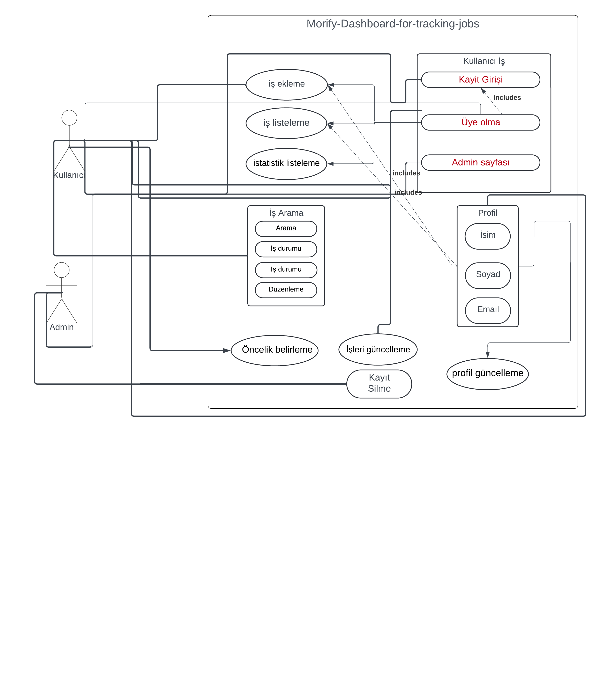
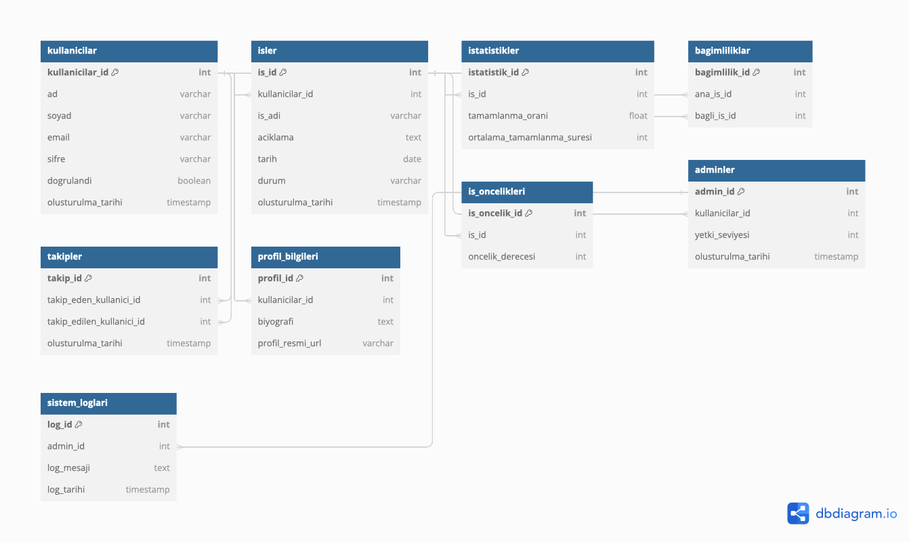

# Morify Dashboard

## Proje Tanımı:
Proje Kategorisi: MERN (MongoDB, Express.js, React.js, Node.js)
Belirtilen Kategori: İş Takibi Uygulaması olucakdır.
## Uygulama Linki Frontend:

[Morify :](https://morify.onrender.com)

## Uygulama Adresi:
[Github :](https://github.com/DeCaster/Morify-dashboard)

## Grup Adı:
Decaster

## Proje Ekibi:
Murad Eyvazli

1. [Proje Planı](ProjePlani.png)
2. [Gereksinim Analizi](Gereksinimler.md)
3. 
4. [Durum Senaryoları](UseCaseTablosu.pdf)
5. 
6. [Front-End](#front-end)
7. [Back-End](#back-end)
8. [Test](#test)
9. [Geliştirici ve Kullanıcı Dokümantasyonları](#geliştirici-ve-kullanıcı-dokümantasyonları)
